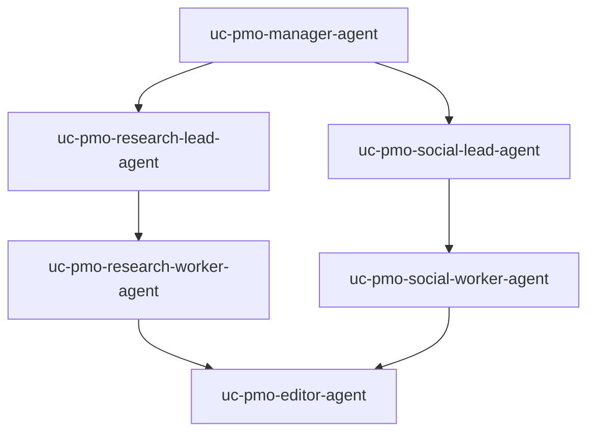

# Cross-functional program office (hierarchical)

## What this is for

This bundle models a **program or launch office** where work splits into **two tracks** (here: **research** and **communications**), each with a **lead** and a **contributor**, then a single **editor** merges both streams into **one deliverable**.

The graph encodes a common real-world rule: the **top manager** delegates to **leads only**—not directly to individual contributors—while the **editor** waits for **both** upstream branches (`join: wait_for_all`) before producing the final artifact. That matches “two workstreams must both land before we publish.”

## Who it is for

- **Enterprise or mid-size teams** mirroring functional lines (research vs comms, eng vs design, etc.).
- **Platform owners** demonstrating **delegation boundaries** and **join** semantics on an `AgentSystem`.

## When to use something else

- **Simple linear brief** with one thread of work → [Weekly intelligence brief](../weekly-intelligence-brief/README.md).
- **Many parallel explorers and feedback loops** → [Roadmap synthesis swarm](../roadmap-synthesis-swarm/README.md).
- **HTTP-triggered runs** → [Event-driven webhook](../event-driven-webhook/README.md).

## What you get

- Six agents and one **`AgentSystem`** (`uc-pmo-system`) with an editor node configured for **`wait_for_all`** join.
- A sample **`Task`** (`uc-pmo-task`) with a product-launch-style topic in `spec.input`.

This folder does **not** include policies, roles, or tools; add those from [`examples/resources/`](../../resources/README.md) when you need governance or integrations.

## Topology



## Files in this folder

| File | Resource |
| --- | --- |
| `model-endpoint.yaml`, `secret-openai.yaml` | Model routing + API key |
| `agents/*.yaml` | Manager, two leads, two workers, editor |
| `agent-system.yaml` | `AgentSystem` `uc-pmo-system` |
| `task.yaml` | `Task` `uc-pmo-task` |

## Apply order (from repository root)

```bash
go run ./cmd/orlojctl apply -f examples/use-cases/cross-functional-pmo/model-endpoint.yaml
go run ./cmd/orlojctl apply -f examples/use-cases/cross-functional-pmo/secret-openai.yaml

go run ./cmd/orlojctl apply -f examples/use-cases/cross-functional-pmo/agents/manager.yaml
go run ./cmd/orlojctl apply -f examples/use-cases/cross-functional-pmo/agents/research_lead.yaml
go run ./cmd/orlojctl apply -f examples/use-cases/cross-functional-pmo/agents/research_worker.yaml
go run ./cmd/orlojctl apply -f examples/use-cases/cross-functional-pmo/agents/social_lead.yaml
go run ./cmd/orlojctl apply -f examples/use-cases/cross-functional-pmo/agents/social_worker.yaml
go run ./cmd/orlojctl apply -f examples/use-cases/cross-functional-pmo/agents/editor.yaml
go run ./cmd/orlojctl apply -f examples/use-cases/cross-functional-pmo/agent-system.yaml
go run ./cmd/orlojctl apply -f examples/use-cases/cross-functional-pmo/task.yaml
```

Use **message-driven** workers with `--agent-message-consume` ([Starter blueprints](../../../docs/pages/architecture/starter-blueprints.md)).

## Hardening (outside this folder)

Layer **`AgentPolicy`**, **`AgentRole`**, **`ToolPermission`**, **`Worker`**, and **`McpServer`** using [`examples/resources/agent-policies/`](../../resources/agent-policies/), [`examples/resources/mcp-servers/`](../../resources/mcp-servers/README.md), and [Set up governance](../../../docs/pages/guides/setup-governance.md).

## Related use cases

- [Weekly intelligence brief](../weekly-intelligence-brief/README.md)
- [Roadmap synthesis swarm](../roadmap-synthesis-swarm/README.md)

## Try this next

- Use **`Task.spec.requirements`** with **`Worker`** capabilities for routing ([resource reference](../../../docs/pages/reference/resources.md)).
